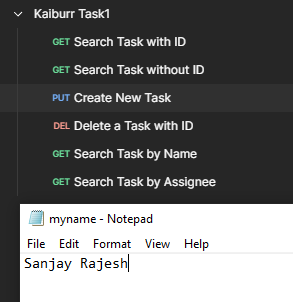
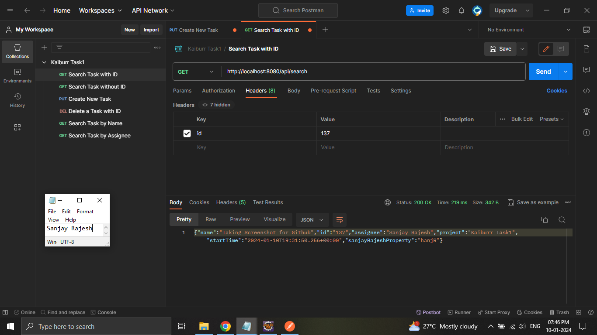

# Kaiburr-Task1
Task 1. Java REST API example

The task is done using Spring boot. The project is made using Spring Initializr, additionally the `spring-boot-starter-data-mongodb` dependency is added to the project which will help the app to connect to MongoDB.

We are using MongoDB Atlas for the project. So the Database is on the cloud and MongoDB connection string is generated from the portal and has been used in the project. The configurations are added in `application.properties` file in the project. For security reasons, I have removed my username and password to connect to MongoDB Atlas.

To run the code I am using Eclipse as my IDE. Since Spring boot project(WAR) comes with tomcat dependencies and Eclipse also has it. We can easily run the application through Eclipse.

The Application mainly has:

1. One REST Controller which will wait for all the resquest that are coming and will process the code and return a Response.
2. One Task Model is created with all the required properties mentioned in the task.
3. One Repository is added, which will help for the Database operations and finally
4. A Service class is created to do the business logics. In our case we have created a function to randomly generate the special prperty everytime a Task is created.

As per the task there are 5 REST API endpoints.

NOTE: The [postman collection](Kaiburr%20Task1.postman_collection.json) is also uploaded in the repository.

# Application responds to requests using postman

The application is running on Eclipse.

First we will do the Task creation. It is a PUT request and the "task" data/object is passed as a json-encoded message in the body.

The created task can be searched with the `/api/search` endpoint. We will pass the same ID here in this case. As you can see the sanjayRajeshProperty is also there in the Response. This has been randomly generated in the code.

If we did not pass any Headers for the `/api/search` endpoint, we will get the list of all the tasks created.

Now to delete a task, we have to access the `/api/delete` endpoint. Along with it we have to pass the Task ID in the headers.

We can also search a task by its Name. This will return all the Tasks with the same name. If no task is fond 404 Response with a message will be returned.

Search can also be done with assignee Name. This will return a max of 10 Task created by the Assignee sorted by the latest time.

# References taken

[Spring Boot and MongoDB](https://www.mongodb.com/compatibility/spring-boot)

[Spring Boot Starter Data MongoDB maven dependency](https://mvnrepository.com/artifact/org.springframework.boot/spring-boot-starter-data-mongodb)

[Pagination and Sorting using Spring Data](https://www.baeldung.com/spring-data-jpa-pagination-sorting)